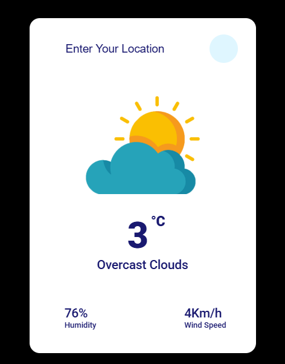

# Weather App 🌦️

Welcome to the **Weather App** project! This app allows users to get accurate and up-to-date weather information for their desired locations. 🌍

## 🌟 Features

- **Search Functionality:** Easily find the current weather of any city by typing its name. 🏙️
- **Real-Time Updates:** Get the latest weather updates, including temperature, humidity, and conditions. ⏰
- **Interactive UI:** A user-friendly and responsive design for an excellent user experience. 🎨

## 📸 Screenshot




> Add these screenshots to showcase the app's interface!

## 🚀 How to Use

1. Open the [Weather App](https://rawcdn.githack.com/Mostafa-khatab/Weather-App/83d15c91549c98b0c8816eb7ca3eec7575e6fa22/weather-app.html) in your web browser.
2. Type the name of your desired city in the search bar. 🖊️
3. View the real-time weather details instantly! 

## 🔧 Functionality Verification

### 1. Search Bar Functionality ✅
   - Input the city name.
   - Verify the API call fetches the correct data.
   - Check if the displayed weather matches the queried location.

### 2. Weather Details Display ✅
   - Ensure temperature, humidity, and conditions are shown correctly.
   - Test the layout responsiveness across devices. 📱💻

### 3. Error Handling ✅
   - Search for an invalid city and verify the error message.
   - Check for smooth handling of API downtime or no internet connection. ⚠️

## 💻 Technologies Used

- HTML5
- CSS3
- JavaScript (ES6)
- OpenWeatherMap API

## 📂 Project Structure

```
Weather-App/
├── index.html
├── css/
│   └── styles.css
├── js/
│   └── script.js
└── assets/
    ├── p1.png
    └── p2.png
```

## 🤝 Contribution

Feel free to fork this repository, raise issues, or submit pull requests. Contributions are always welcome! 🙌

## 📄 License

This project is licensed under the MIT License. See the LICENSE file for more details.

---

💡 **Pro Tip:** Always double-check the functionality after every update to ensure a seamless user experience. 🚦
